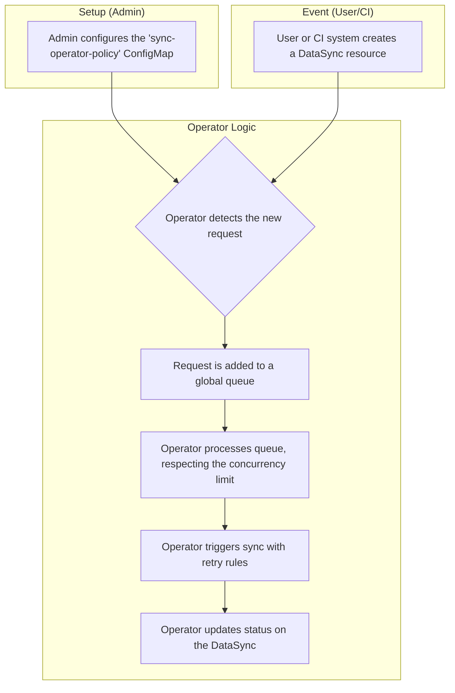

## **Formal Design Proposal: Data Sync Operator**

This document proposes the creation of a Kubernetes Operator to automate and control the deployment of resource-intensive Kubernetes Storage Objects which are the backing of workspaces hosted on Open Terrain (OT). A given workspace can have multiple versions actively in use at one time. The proposed system will replace a manual process with an automated, on-demand workflow that prevents network saturation and controls data transfer costs. This is achieved by introducing a `DataSync` Custom Resource Definition (CRD) to act as a record for the data required to boot a workspace. A controller is also created that orchestrates the creation of the storage objects represented by the CRD while adhering to a globally defined sync policy stored in a `ConfigMap`.

### 2. Background and Problem Statement
Currently workspaces on OT require sets of storage objects to exist as prerequisite of the creation of instances of workspaces. The creation of these sets of storage resources initiates a significant data download to get the data which will back workspaces. The manual process for managing these storage objects, referred to as syncing by the team, has lead to several issues:

### 2.1 Main pain points
- **Network Saturation**: When multiple sets of storage objects are synced simultaneously, the combined data transfer can overwhelm the cluster's network, impacting other workloads.
- **Cost Overruns**: A failing sync can enter a retry loop, repeatedly attempting to download large amounts of data. This leads to unpredictable and often significant data egress costs.
- **Manual Toil**: The process requires manual intervention, is not easily auditable, and cannot be integrated into automated CI/CD pipelines efficiently.
- **Resource preloading**: Currently our sync process has no ability to preload the data required for workspace. It is on admins to ensure that resources are up to date in our environments. Our new solution should remove this mental toil and have our environment keeping track of itself.

### 2.2 Secondary pain points
- **Unrecoverable workspace launch edge case**: in our current solution if a user launches a workspace prior to the workspace resources being synced in the environment this is an unrecoverable error. In order to handle an error of this kind we must kill the workspace and restart it once the storage objects are are ready to be used.
- **Stale workspace data management**: Currently pruning old versions of our data requires manual work to determine if the resources are in use by any workspaces. The logic to determine this is non-trivial and error prone.


### **3. Proposed Controller Architecture**
The proposed architecture is built on standard Kubernetes patterns, consisting of a `ConfigMap` for policy definition, a CRD to represent the data required to boot a workspace, and a custom Operator to handle orchestration of resources.

#### **3.1 The Policy `ConfigMap`**

To avoid the complexity of a new CRD for policy, the operator's behavior will be defined by a single, cluster-wide `ConfigMap`. This provides a simple, declarative way to configure the system's rules without requiring an operator restart.

**Example `ConfigMap` Manifest:**
```yaml
apiVersion: v1
kind: ConfigMap
metadata:
  name: sync-operator-policy
  # This should be in the same namespace as the operator
  namespace: sync-operator
data:
  # The maximum number of DataSync allowed to be syncing at once.
  concurrency: "4"
  # The number of times to retry a failed sync.
  retryLimit: "2"
  # The initial duration to wait after a failure before retrying.
  retryBackoffDuration: "5m"
```

#### **3.2 `DataSync` CRD**

The CRD will acts as a way for us to manage the lifecycle of the set of data required for a given workspace.

**Example `DataSync` Manifest:**
```yaml
apiVersion: "pelotech.ot/v1alpha1"
kind: "DataSync"
metadata:
  name: "sync-workspace-123"
spec:
  # The unique identifier for the workspace to be synced.
  workspaceId: "035"
  vms: "yaml list of vms with name, url, sourceType"
# The operator manages this section to provide real-time status and auditability.
status:
  phase: "Queued"
  message: "Request is waiting for an available worker."
  conditions:
type: "Ready"
      status: "False"
      lastTransitionTime: "2025-07-11T20:57:00Z"
```

#### **3.3: The Operator**
The operator is the core of the system, acting as an intelligent controller that connects management of workspace Data to a predefined policy.
**Operator Logic:**
- **Initialization**: On startup, the operator reads its configuration from the `sync-operator-policy` `ConfigMap`.
- **Watch for Requests**: The operator watches for new `DataSync` resources to be created in the cluster. The operator will also watch for changes on the configmap to ensure it enforces the correct rules.
- **Queue Requests**: When a new request is detected, it is added to a single, global First-In, First-Out (FIFO) queue.
- **Enforce Policy**: The operator processes the queue, ensuring the number of active syncs never exceeds the `concurrency` limit from the `ConfigMap`. It creates the storage objects respecting the defined retry logic.
- **Provide Status**: The operator provides real-time feedback by continuously updating the `status` field of the `DataSync` resource as it moves through its lifecycle (e.g., `Queued`, `Syncing`, `Succeeded`, `Failed`).

### **4. End-to-End Operator Workflow**

### **5. Addressing the need to preload resources**

The team currently has a pipeline which we use to publish workspaces we can hook into the pipeline to create or update existing `DataSync` resources as well. This would ideally allow the team to keep all our resources as fresh as possible and use current team workflows to accomplish this.

An alternative option would be to increase the complexity of the operator to "watch" a some source of truth however given the required complexity to accomplish this the team has chosen to go with the option that is the least amount of lift.

### **6. Addressing the unrecoverable workspace edge case** (Non-mvp)

Assuming that we are able to preload resources effectively this should hopefully be less common or removed entirely. The team has decided to use a manual workaround for the time being and update the operator post MVP. The team acknowledges that this is non-optimal and will update the operator post MVP to address this use case.

### **7. Stale workspace data management** (Non-mvp)

In environments where users are using many different versions of workspaces each with their own sets of required storage objects the team will continue the manual workflow for the time being. The operator will be be updated later on to solve this pain point.
